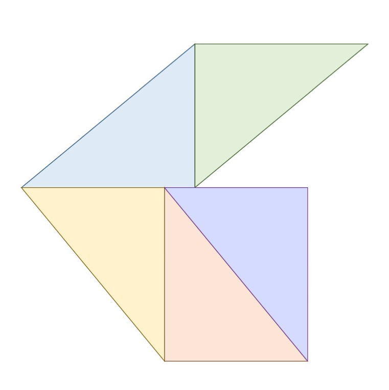

Handwriting comparative analysis has recently been criticized based off the subjective nature of traditional examinations. To support traditional examination with objective measures, this project provides results from a study where features of handwriting are examined through point decomposition and rainbow triangulation.
By forming rainbow triangles over these samples, it is possible to gauge the variation within a single writer and to compare these quantitative values to other samples of unknown sources. Using this information, the study aims to form a quantitative analysis of handwriting samples and to calculate how similar or dissimilar two samples are from one another. One of the study's main goals is to form these triangles from multiple samples from several different writers and to group, identify, and accurately determine what samples came from which writer. Finally, multiple summary statistics are explored to determine whether any can be used to discriminate between inclusions and exclusions using data where ground truth is known such as a true match. This project hopes to impact the forensic community by demonstrating a new method for analyzing handwriting that could be used in junction with current practices to be able to better quantify and support results regarding sources.